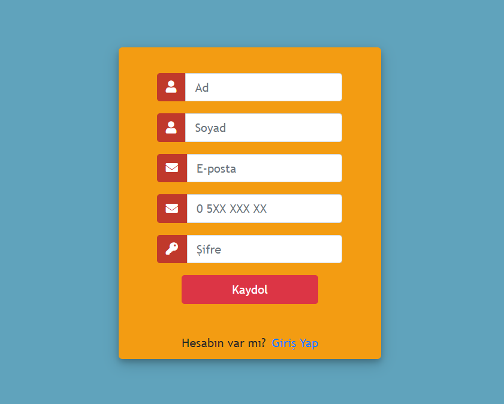
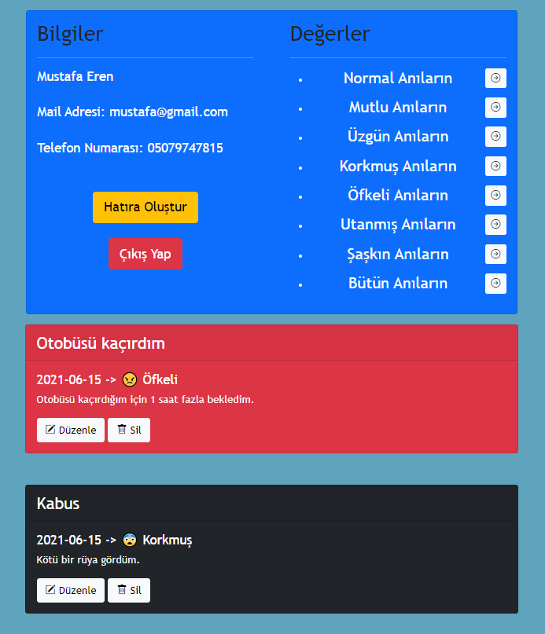
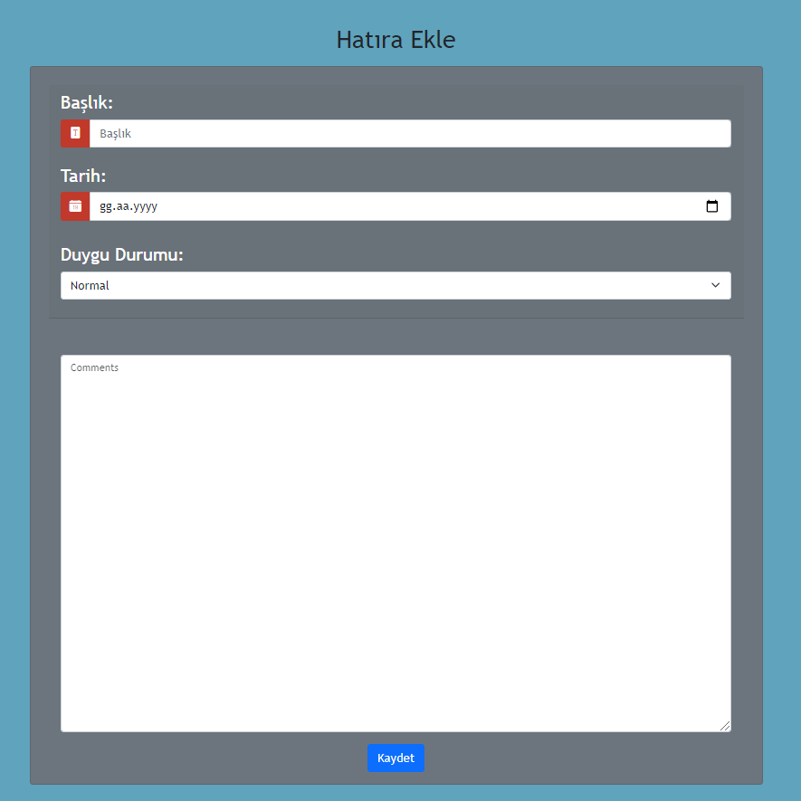

# Online Anı Defteri

Siteye [buraya](http://anilar.6te.net/login.php) tıklayarak ulaşabilirsiniz.

# Genel Özet
Sadece sizin görüntüleyebileceğiniz online bir günlük sitesi.
## Proje Amacı
Bursa Teknik Üniversitesi Web Tabanlı Programlama Dilleri dersi için PHP ve MySQL projesi.

# Site kullanımı ve görüntüleri

Hesabınız varsa bu sayfadan e-posta ve şifreniz ile giriş yapabilirsiniz.

Hesabınız  yoksa yeni bir hesap oluşturmak için gerekli alanları doldurmanız gerekiyor. Kayıt olduktan sonra anasayfaya yönlendirileceksiniz.

Ana sayfada anılarınızı görüntüleyebilir ve filtreleyebilirsiniz. Default olarak bütün anılarınız gelir ama yukardaki menu yardımıyla sadece belirli duygu durumunuzdaki 
anilarinizi görüntüyebilirsiniz. Ve her bir anıyı düzenleyip silebilirsiniz.

Daha önce hatıra oluşturmadıysanız Hatıra Oluştur butonuna tıkladıgınızda üstteki sayfaya yönlendirilecek ve anı kaydedebileceksiniz.

# Kullanılan Teknolojiler
- HTML
- CSS
- PHP
- MySQL

# Site Linki
Siteyi kullanabilmek için bu sayfaya gidiniz. -> http://anilar.6te.net/

# İletişim
[Linkedin](https://www.linkedin.com/in/mustafa-eren-9214661b3/)
- Mustafa Eren ->  [@MustafaErenn](https://github.com/MustafaErenn)

